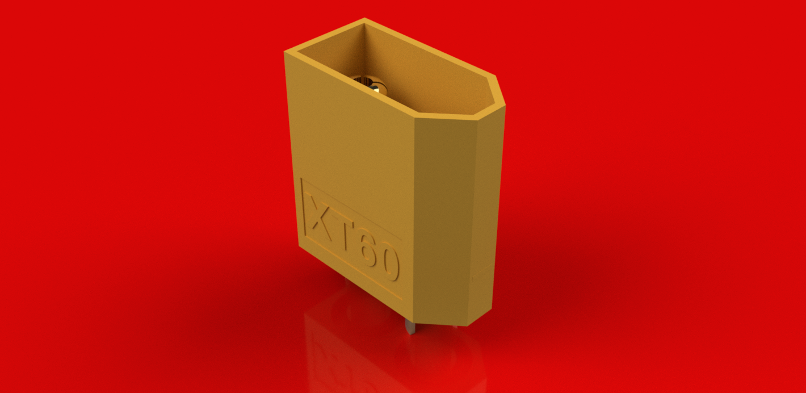
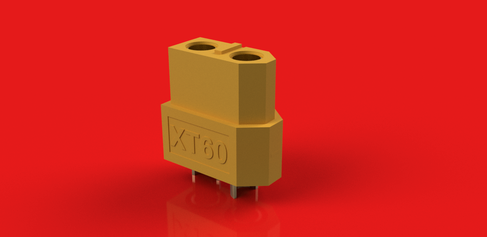

# XT60 Connector Set (Male & Female)

  
  &nbsp;&nbsp;
  

---

## Overview

An accurate 3D CAD model set of the **XT60 Male and Female Connectors**, created in **Autodesk Fusion 360** using dimensions referenced from manufacturer documentation and available technical references.

This model set is suitable for:

- PCB assembly visualization
- Enclosure design
- Mechanical integration
- Product prototyping
- Engineering education

---

## Specifications

| Property | Value |
|----------|-------|
| Component | XT60 Connector Set |
| Connector Types | Male & Female |
| Number of Contacts | 2 |
| Rated Current | Up to 60 A |
| Rated Voltage | Up to 500 V DC |
| CAD Software | Autodesk Fusion 360 |
| File Formats | STEP, STL |

---

## Downloads

| File | Description |
|------|-------------|
| `XT60Male_SS.step` | XT60 Male Connector CAD model |
| `XT60Male_SS.stl` | XT60 Male Connector mesh model |
| `XT60Female_SS.step` | XT60 Female Connector CAD model |
| `XT60Female_SS.stl` | XT60 Female Connector mesh model |

---

## Model Status

- ✅ STEP models included
- ✅ STL models included
- ✅ Suitable for mechanical representation
- ✅ Ready for enclosure and PCB design

---

## Applications

- RC aircraft
- Drones
- Robotics
- Battery packs
- High-current power distribution
- DIY electronics

---

## Reference

Dimensions were modeled using manufacturer documentation, available technical references, and verified measurements where applicable.

---

## Author

**Designed by:** Shreyas Suvarna V

B.Tech Electronics & Communication Engineering

NMAM Institute of Technology (NMAMIT)

GitHub: https://github.com/Shreyas64815

---

## License

This model is provided for educational, research, and engineering purposes.

Attribution is appreciated if these models are used in public projects or publications.
