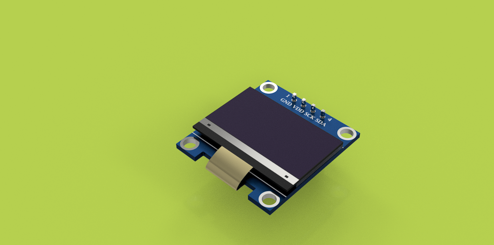
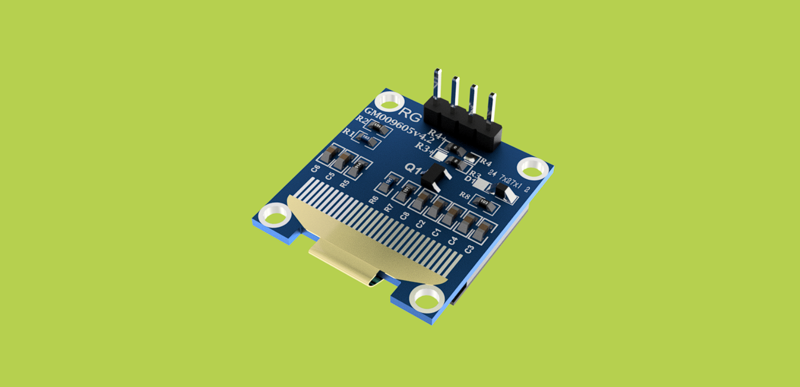

# 0.96" OLED Display Module

  
  &nbsp;&nbsp;
  

---

## Overview

An accurate 3D CAD model of a **0.96-inch OLED Display Module**, created in **Autodesk Fusion 360** using dimensions referenced from manufacturer documentation and available technical references.

This model is suitable for:

- PCB assembly visualization
- Enclosure design
- Mechanical integration
- Product prototyping
- Engineering education

---

## Specifications

| Property | Value |
|----------|-------|
| Component | 0.96" OLED Display Module |
| Display Type | OLED |
| Interface | I²C |
| Resolution | 128 × 64 |
| Mounting Type | Through-Hole Header |
| Pin Count | 4 |
| CAD Software | Autodesk Fusion 360 |
| File Formats | STEP, STL |

---

## Downloads

| File | Description |
|------|-------------|
| `OLED096_SS.step` | Standard CAD model compatible with most CAD software |
| `OLED096_SS.stl` | Mesh model suitable for 3D printing and visualization |

---

## Model Status

- ✅ STEP model included
- ✅ STL model included
- ✅ Suitable for mechanical representation
- ✅ Ready for PCB and enclosure design

---

## Applications

- Embedded systems
- Robotics
- IoT projects
- User interfaces
- Portable electronics
- Educational projects

---

## Reference

Dimensions were modeled using available technical references, and verified measurements where applicable.

---

## Author

**Designed by:** Shreyas Suvarna V

B.Tech Electronics & Communication Engineering

NMAM Institute of Technology (NMAMIT)

GitHub: https://github.com/Shreyas64815

---

## License

This model is provided for educational, research, and engineering purposes.

Attribution is appreciated if this model is used in public projects or publications.
