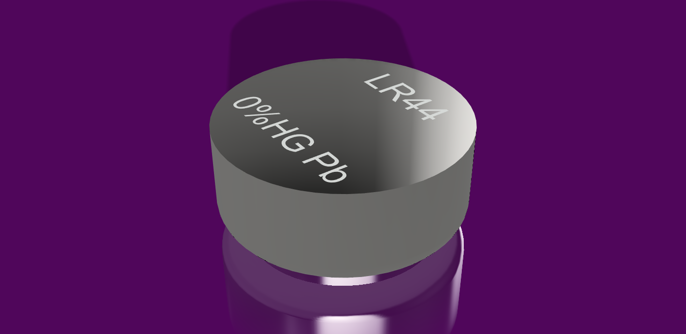

# LR44 Alkaline Button Cell

  

---

## Overview

An accurate 3D CAD model of an **LR44 Alkaline Button Cell**, created in **Autodesk Fusion 360** using dimensions referenced from manufacturer documentation and available technical references.

This model is suitable for:

- PCB assembly visualization
- Battery holder design
- Enclosure design
- Mechanical integration
- Product prototyping
- Engineering education

---

## Specifications

| Property | Value |
|----------|-------|
| Component | LR44 Alkaline Button Cell |
| Battery Chemistry | Alkaline |
| IEC Designation | LR44 |
| Battery Type | Button Cell |
| Nominal Voltage | 1.5 V |
| CAD Software | Autodesk Fusion 360 |
| File Formats | STEP, STL |

---

## Downloads

| File | Description |
|------|-------------|
| `LR44_SS.step` | Standard CAD model compatible with most CAD software |
| `LR44_SS.stl` | Mesh model suitable for 3D printing and visualization |

---

## Model Status

- ✅ STEP model included
- ✅ STL model included
- ✅ Suitable for mechanical representation
- ✅ Ready for battery holder and enclosure design

---

## Applications

- Calculators
- Watches
- Laser pointers
- Toys
- Medical devices
- Portable electronic products

---

## Reference

Dimensions were modeled using manufacturer documentation, available technical references, and verified measurements where applicable.

---

## Author

**Designed by:** Shreyas Suvarna V

B.Tech Electronics & Communication Engineering

NMAM Institute of Technology (NMAMIT)

GitHub: https://github.com/Shreyas64815

---

## License

This model is provided for educational, research, and engineering purposes.

Attribution is appreciated if this model is used in public projects or publications.
