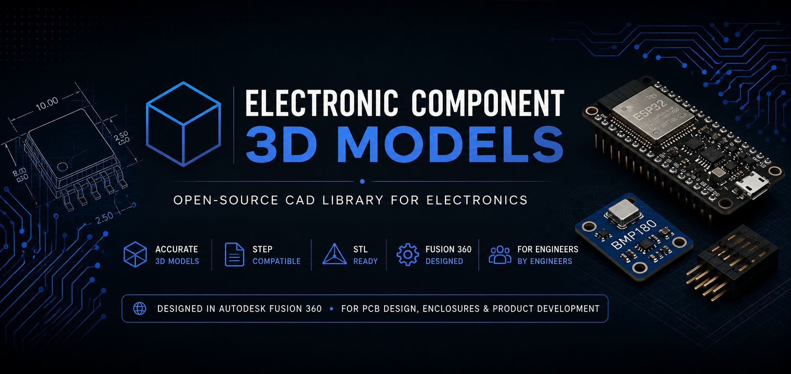

<p align="center">
  
</p>

<h1 align="center">Electronic Component 3D Models</h1>

<p align="center">
A growing collection of accurate electronic component CAD models created in Autodesk Fusion 360.
</p>

---

## 📖 About

This repository contains high-quality 3D CAD models of commonly used electronic components for:

- PCB assembly visualization
- Product enclosure design
- Mechanical integration
- Robotics projects
- Embedded systems
- Engineering education

Every model is organized with documentation, preview images, and industry-standard CAD formats.

---

# 📊 Repository Statistics

| Item | Count |
|------|------:|
| 📦 Total Components | **2** |
| 📂 Categories | **9** |
| 📐 STEP Models | **2** |
| 🖨 STL Models | **2** |

---

# 📁 Categories

| Category | Components | Status |
|----------|-----------:|:------:|
| 📡 Sensors | **2** | 🟢 |
| 💻 Microcontrollers | **0** | ⚪ |
| ⚙️ motors | **0** | ⚪ |
| 🖥 Displays | **0** | ⚪ |
| 🔌 Connectors | **0** | ⚪ |
| ⚡ Power | **0** | ⚪ |
| 📦 Miscellaneous | **0** | ⚪ |
| 🧩 Modules |**0**|⚪|
| 🧩 Electromechanical |**1**|🟢|

---

---

# 📂 Repository Structure

```text
Electronic-Component-3D-Models
│
├── Connectors
├── Displays
├── Electromechanical
├── Microcontrollers
├── Miscellaneous
├── Module
├── Motors
├── Power
└── Sennsors
```

---

# ⭐ Quality Standard

Every uploaded component follows these principles:

- ✅ STEP model included
- ✅ STL model included
- ✅ Preview image included
- ✅ Suitable for enclosure and mechanical design

---

# 🛠 Software

Models are created using:

- Autodesk Fusion 360

---

# 👨‍💻 Author

**Shreyas Suvarna V**

B.Tech Electronics & Communication Engineering

NMAM Institute of Technology (NMAMIT)

---

# 📜 License

These models are provided for educational, research, and engineering purposes.

Attribution is appreciated if these models are used in public projects or publications.
