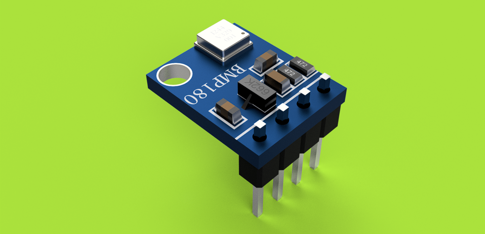

# BMP180 Pressure Sensor Module

## Description

This repository contains an accurate 3D CAD model of the BMP180 Pressure Sensor Module, created in Autodesk Fusion 360 using dimensions referenced from the manufacturer's datasheet.

The model is intended for:
- PCB assembly visualization
- Enclosure and product design
- Mechanical integration
- Engineering projects and prototyping

---

## Included Files

| File | Description |
|------|-------------|
| BMP180_SS.step | Standard CAD model compatible with most CAD software |
| BMP180_SS.stl | Mesh model suitable for 3D printing and visualization |
| preview.png | Rendered preview of the component |

> **Note:** The original Fusion 360 design file is not included.

---

## Compatibility

The STEP model can be imported into software such as:

- Autodesk Fusion 360
- SolidWorks
- Siemens NX
- Autodesk Inventor
- PTC Creo
- CATIA
- FreeCAD
- Onshape

---

## Reference

Dimensions were modeled using the official manufacturer datasheet and verified for accurate mechanical representation.

---

## Author

**Designed by:** Shreyas Suvarna

Electronics & Communication Engineering Student  
NMAM Institute of Technology (NMAMIT)

---

## License

This model is provided for educational, research, and engineering purposes.

If you use this model in your projects or publications, attribution is appreciated.
