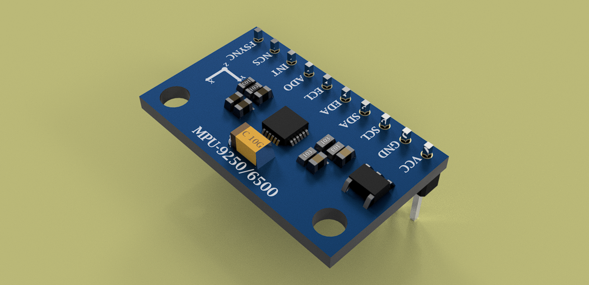

# MPU-9250 9-Axis Motion Tracking Module

  

---

## Overview

An accurate 3D CAD model of the **MPU-9250 9-Axis Motion Tracking Module**, created in **Autodesk Fusion 360** using dimensions referenced from the manufacturer's datasheet.

This model is suitable for:

- PCB assembly visualization
- Enclosure design
- Mechanical integration
- Product prototyping
- Engineering education

---

## Specifications

| Property | Value |
|----------|-------|
| Component | MPU-9250 Motion Tracking Module |
| Sensor Type | 9-Axis IMU |
| Interface | I²C / SPI |
| Pin Count | 8 |
| CAD Software | Autodesk Fusion 360 |
| File Formats | STEP, STL |

---

## Downloads

| File | Description |
|------|-------------|
| `MPU-9250_SS.step` | Standard CAD model compatible with most CAD software |
| `MPU-9250_SS.stl` | Mesh model suitable for 3D printing and visualization |

---

## Model Accuracy

- Suitable for PCB and enclosure design
- Intended for mechanical representation

---

## Applications

- Robotics
- UAVs and drones
- Motion tracking
- Navigation systems
- Embedded systems

---

## Reference

MPU 9250 sensor

---

## Author

**Designed by:** Shreyas Suvarna V

B.Tech Electronics & Communication Engineering

NMAM Institute of Technology (NMAMIT)

---

## License

This model is provided for educational, research, and engineering purposes.

Attribution is appreciated if this model is used in public projects or publications.
